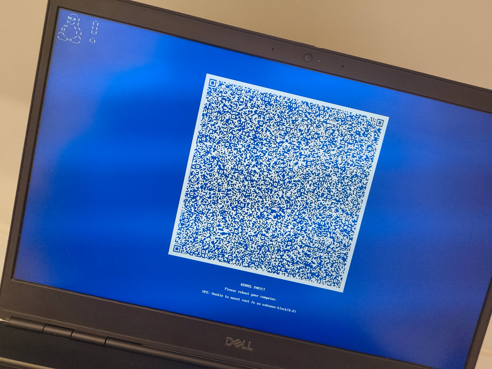

# Kernel-Panics
- What exactly is a kernel panic? It's a type of kernel error where the system enters a fatal state in which it cannot continue without any dataloss, such cases are severe and require booting from the usb to fix the system.

# The situation
- I was updating my arch linux setup via sudo pacman -Syu and mid update, my wifi cut off for 2 seconds, I thought it was normal since usually the installation pauses, but what I did not know was it was updating gcclibs which is a crucial package for all linux environments, after realizing it was gone my system entirely stopped working and i researched on my phone on what to do next, it said to not reboot or it may be fatal, however the only fix i had was to boot into the live usb which is the same usb that i've dualbooted my windows and linux together.

# My solution

## My first attempt
- Of course after booting into the usb I was greeted with the live shell, my pacman wasnt working so I needed to connect to my internet via iwctl. After connecting successfully i needed to install gcclibs via pacstrap which is the same as pacman but for initializing new linux systems, so it comes with the defaults and essentials. I first mounted my main partition and ran pacstrap -K gcc-libs, where it installs successfuly, after thinking this was my solution, I unmount my main partition via umount -R and then rebooted. After rebooting i was greeted with my grub bootloader and i chose my linux environment, 10 seconds in and i was greeted with a kernel panic.

 

## My second attempt
- Now usually most of the time kernel panics occur due to the initramfs being corrupted or missing, however i had doubts as to how this was my case because i did not touch the initramfs, so to test my luck i re booted into the live usb, mounted my main partition at /mnt and my boot partition at /mnt/boot, and i chroot into /mnt, after a couple of research i learnt that one of the ways to restore initramfs was to run "mkinitcpio -P", this command generates initramfs and reads the preset file to know where to instantiate it, in my case it was in /boot, hence the -P flag.
- After unmounting my main partition and my boot partition i reboot and get greeted with the grub bootloader, i chose my linux environment and then after 10 seconds i finally get greeted with my old SDDM login screen.
